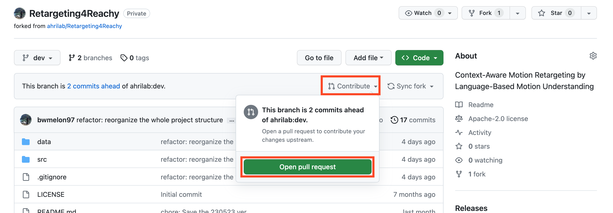

# Contributing & Collaborating Guideline
Please follow this guideline before contributing to this repository.

The collaboration guide is divided into three parts: (1) Writing code, (2) Committing works, and (3) Combining works.


## 1. Code Styling
- Use the '**Black**' Formatter.
- Set the max line length as '**119**'.
- Please check your code style before progressing 'git commit' your work.
    - **Option 1**: If you use vscode, you can just use the 'Black Formatter' Extension. To activate the formatter & 'Format On Save' functions, follow the guide below.
        1. Open the settings by pressing '`cmd` (or `ctrl`) + `,`'
        2. Type 'python.formatting.provider', and choose the 'black' option.
        3. Type 'editor.format on save', and check this option as true.
        4. Type 'python.formatting.black args' and add items '--line-length', and '119'.
    - **Option 2**: You can run the formatter directly in the CLI interface.
        1. Install the 'black' package by `pip install black`.
        2. Run this command to check the format of the code: `black --check main.py`. Please replace the argument 'main.py' with the file you want to check.
        3. You can fix the code format with this command: `black main.py`.

#### Notes:
- Why should we use a formatter: 
- Black: 
- Max line length: 

#### References for Code Styling
- [Official Github Repository](https://github.com/psf/black)
- [Documentation](https://black.readthedocs.io/en/stable/index.html)
- https://clolee.tistory.com/86
- https://jiku90.tistory.com/12
- https://dev.to/adamlombard/vscode-setting-line-lengths-in-the-black-python-code-formatter-1g62


## 2. Commit Message Guideline
Please follow this guideline when you write a commit message. The overall structure of the commit message is shown below:

```
TAG(scope): Subject

Body

Footer
```

### Subject

The subject is the most important part of the commit message. This is a summary of the updates in your work, which other people can infer from one line. Subject can be broken down into two parts: TAG, and subject.

#### Commit Tag
The prefix part of the subject identifies the type of updates. Tags should be written in lowercase, followed by a ': ' and the subject. The possible types of tags are below:

- **feat**: Add a new feature or improve a feature.
- **fix**: Fix any bugs or malfunctioning parts of existing codes.
- **docs**: Update on any documentation or comments on the codes.
- **refactor**: Change names of variables & functions/structure of code & directory, without changes in functionality of the code.
- **chore**: Any other updates not included above types (e.g. initiate a project, update on gitignore, code format, requirements, and so on).

> [Optional] Scope: If you want to specify which files (or features) have changed, you can add scope information right after the tag with parentheses.

#### Subject
- Limit the subject line to 50 characters.
- The subject should start with capital letters (uppercase).
- Do not end the subject line with a period.
- Use the imperative mood in the subject line instead of the past tense.

#### Example
```
docs: Add contributing.md
feat(net): Add additional layers to the network structure
```


### Body

- It is recommended to describe 'why' this update was made, rather than 'what' this update is.


#### References for Commit Convention
- https://cbea.ms/git-commit/
- https://blog.munilive.com/posts/my-git-commit-guide.html
- https://velog.io/@archivvonjang/Git-Commit-Message-Convention
- https://medium.com/@naandalist/creating-a-git-commit-message-convention-for-your-team-acb4b3edfc44


## 3. Collaborate Process

#### 1) Fork this repository into your personal GitHub account repository.


The fork process is required to use the pull request feature of GitHub.

#### 2) Work on your personal repository and check your repository is up-to-date before making a pull request.

When you want to update your repository version, please use the `fetch` and `rebase` commands (the `git pull` command is not recommended).

```bash
git fetch upstream dev
git rebase upstream/dev
```

Note that:

- The `upstream` repository represents the team repository, and the `origin` repository represents your personal repository.
- Before making a pull request, please check if you follow the code format & commit message convention.

#### 3) You can freely push (even force push) to your personal repository (origin), but it is not allowed to push to the team repository (upstream) directly.

```bash
git push origin dev                 # O
git push --force origin dev         # O
git push upstream dev               # X
```

#### 4) If your work is done, please make a pull request to the `dev` branch of the upstream repository.



- If you make an update on your repository (origin), the pull request button will appear.
- Be careful not to pull requests to other branches (The valid branch is the `dev` branch of the upstream).
- Before making a pull request, please check if you follow the code format & commit message convention.

